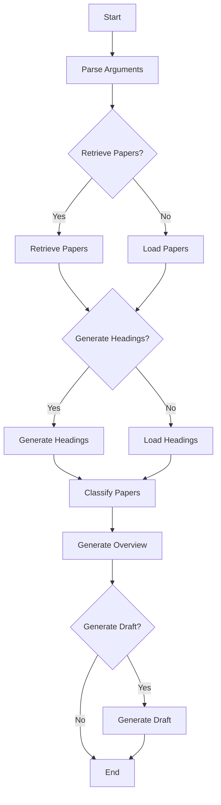

# GenSurv
- [English](README.md)
- [日本語](README_ja.md)


## About
GenSurv (Generative Survey) is a volunteer initiative aimed at exploring and establishing methods to streamline literature reviews using generative AI. Currently, we are engaged in the following specific endeavors:
- Developing an agent that engages in dialogue to delve deeper into the information users seek, retrieves appropriate literature, and provides summarized responses
- Visualizing areas not approached by prior research by vectorizing literature information
- Developing a system that stores literature information in a vector database and uses it as a basis to answer user questions

For more details about the project, past activities, and how to participate, please check [here](https://gensurv.notion.site/GenSurv-080bd169f48849568ef001a4aa08ca1e?pvs=4).

## Requirements
- Python 3.11.4

## Setup
Environment variables
```shell
cp .env.sample .env  # Replace with your own API keys, etc.
```

Python environment
```shell
python -m venv .venv
source .venv/bin/activate
pip install -r requirements.txt
```
## Usage
Executing the script
```shell
python src/main.py --title "Laboratory automation" \
  --retrieve_papers --max_papers 5 \
  --generate_headings \
  --output_path data
```

To run the evaluation function（evaluate_headings.py） from the src directory, use the following command
```
python -m gensurv.scripts.evaluate_headings \
  --input_data_path ../data/test/manual_by_ono/headings_input_data.json \
  --eval_data_path ../data/test/manual_by_ono/headings_evaluation_data.json
```

Launching the application (locally)
```shell
gradio src/app.py
```

Launching the application (creating a shared link)
```shell
gradio src/app.py --share
```


## Flow Chart

