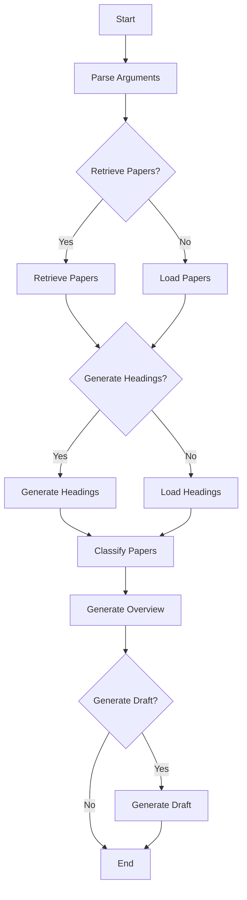

# GenSurv
- [English](README.md)
- [日本語](README_ja.md)


## About
GenSurv (Generative Survey) は生成AIを活用し、文献調査を効率化する手法の探索・確立を目指す有志による活動です。現在、具体的には以下のような取り組みを行っています。
- 対話しながらユーザーの求める情報を深掘りし、適切な文献を取得し要約を回答するエージェントの開発
- 文献情報をベクトル化することで先行研究がアプローチしていない領域の可視化
- 文献情報をベクトルデータベースに格納し、それらを根拠にユーザーの質問に回答するシステムの開発

プロジェクトの詳細や過去の活動、参加方法については[こちら](https://gensurv.notion.site/GenSurv-080bd169f48849568ef001a4aa08ca1e?pvs=4)をご確認ください。

## Requirements
- Python 3.11.4

## Setup
環境変数
```shell
cp .env.sample .env  # APIキーなどを自分のものに書き換える
```

Python環境
```shell
python -m venv .venv
source .venv/bin/activate
pip install -r requirements.txt
```
## Usage
スクリプト実行
```shell
python src/main.py --title "Laboratory automation" \
  --retrieve_papers --max_papers 5 \
  --generate_headings \
  --output_path data
```

アプリケーション起動（ローカル）
```shell
gradio run src/app.py
```

アプリケーション起動（共有リンク作成）
```shell
gradio run src/app.py --share
```


## Flow Chart

